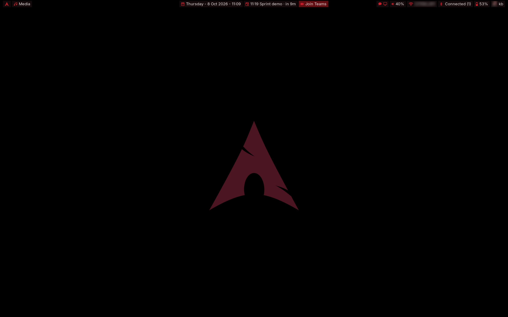
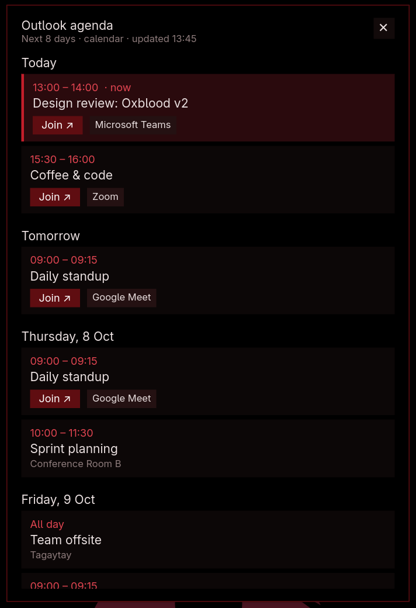
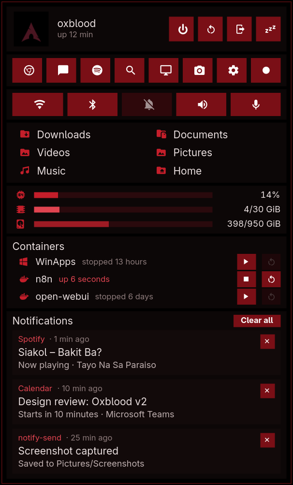
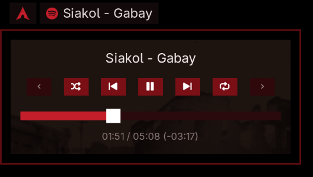
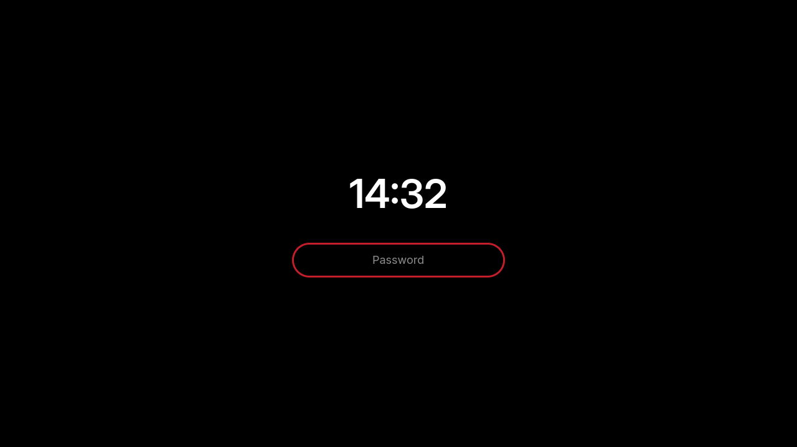
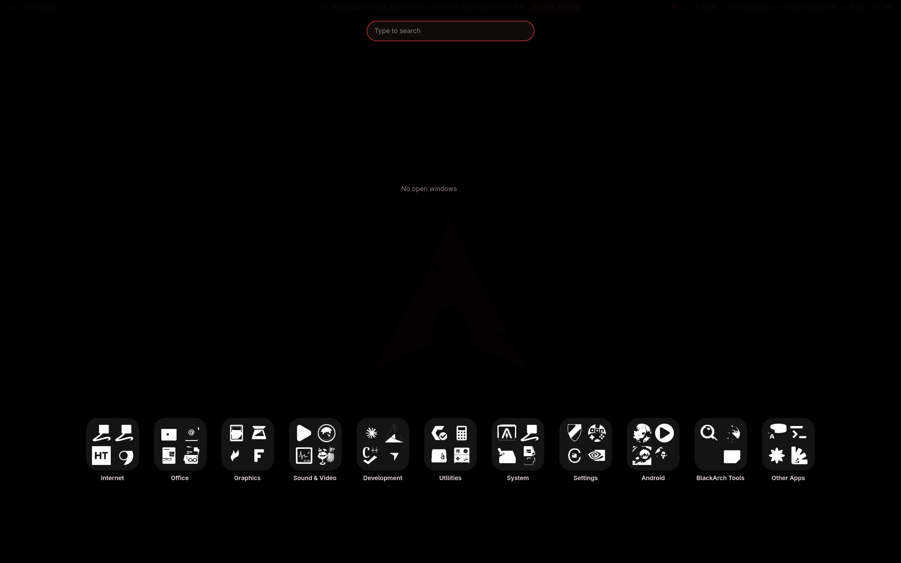
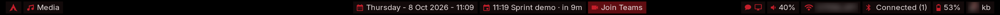

# Oxblood

**A dark-red, non-tiling Hyprland + HyprPanel setup that feels like GNOME but runs like Hyprland.**
Windows float like on a normal desktop; nothing tiles unless you snap it. Pure OLED black, oxblood and crimson accents, square corners, no animations, no blur. Just a quiet desktop that stays out of your way.




| Calendar & schedule | Dashboard | Media menu with time left |
|---|---|---|
|  |  |  |

| Login screen | App grid |
|---|---|
|  |  |

> The calendar events and notifications in the screenshots are demo data. The Wi-Fi name and avatar in the top bar are blurred in the screenshots only, not in the theme.

---

## The story

*(Partly true, partly embroidered. That's how good rice stories go.)*

It started on a rainy Tuesday in Pasay. A typhoon signal was up, the office had sent everyone home, and I was stuck on a laptop with a GNOME desktop I liked but no longer loved. It was polished and sensible, and it looked like everyone else's.

I had Siakol's *Bakit Ba?* on repeat. Somewhere in the second chorus I looked at the ROG keyboard glowing a deep red in the dark room, then at the cold grey desktop on the screen, and thought: *why don't these match?*

The keyboard was the color of old wine, of a jeepney's faded paint, of the red in a barong's embroidery under lamplight. Designers call it **oxblood**. That became the brief:

1. **Black like the screen is off.** On an OLED panel, true `#000000` pixels cost nothing, so the battery lasts longer and the red really glows.
2. **One color family, used with restraint.** `#4a1521` for surfaces, `#c41e2a` for anything you can press, a pale `#e8dede` for text. No rainbows.
3. **Keep what GNOME got right.** Drag a maximized window and it un-maximizes. Drag a window to an edge and it snaps. Click to focus. One set of window buttons, never two.
4. **Nothing moves unless you move it.** Animations off. The lock screen appears instantly, no fade.

Hyprland gave me the control and HyprPanel gave me the bar. The rest took many late nights: a small C++ plugin to make maximize and snapping behave like GNOME, a few Python/GTK4 popups for the dashboard, app grid and calendar, and patches to HyprPanel so the tray opens on left-click, long song titles scroll instead of being cut off, and the media menu tells you how much of the song is **left**:

```
01:51 / 05:08 (-03:17)
```

That last one came from wanting to know whether I had time for the whole guitar solo before a meeting. (I usually didn't.)

The typhoon passed and I kept the desktop. I hope it works for you too.

---

## Floating, not tiling

Hyprland is famous as a tiling compositor. **Oxblood turns tiling off.** It behaves like GNOME, macOS or Windows:

- **New windows open floating**, centered, at one comfortable size (1092×564). They don't push other windows around.
- **Title bars with one set of buttons** (minimize, maximize, close). Apps that draw their own buttons, like GNOME apps, Firefox or VS Code, get no extra bar, so you never see two sets.
- **Maximize fills the screen** but stays a normal window: the bar stays visible and other windows can still go on top. Double-click a title bar to maximize, or press `Super + F`. Real fullscreen is still `Super + Shift + F`.
- **Drag a maximized window** and it restores to its old size under your cursor, like GNOME.
- **Snap on demand**: drag a window to the left or right edge (a preview shows where it will land) or use `Super + ←/→`. Drag to the top or press `Super + ↑` to maximize.
- **Click to focus**, and the clicked window comes to the front. Hovering doesn't steal focus.
- **Resize from any edge**, even without a visible border.
- **Minimize** with the title-bar button or `Super + H`. Minimized windows go to a hidden workspace (`Super + Shift + H` shows them).

The small `kb-minimize` plugin, the `edge-snap.py` script and `kb-maximize` do this work. Want tiling back? Remove the `float-all` window rule in `hyprland.lua`; the layout underneath is already `dwindle`.

## What's inside

| Path | What it does |
|---|---|
| `config/hypr/hyprland.lua` | Hyprland config (Lua). GNOME-style focus, gestures, keybinds, no animations |
| `config/hypr/titlebars.lua` | Title bars (hyprbars) with one button set per window; apps that draw their own buttons get no bar |
| `config/hypr/hyprlock.conf`, `hypridle.conf` | Black lock screen with clock and password box; idle → lock → screen off |
| `config/hypr/scripts/` | Edge snapping with preview, snap/maximize helpers, power menu, screenshots |
| `config/hyprpanel/` | HyprPanel theme (oxblood palette), custom modules (calendar, Join-meeting button, status) |
| `config/gtk-3.0`, `gtk-4.0` | GTK accent color so apps match |
| `config/systemd/user/kb-autounmute.service` | Unmutes the speaker or mic as soon as you change its volume (the mute key alone still mutes). Enabled by `install.sh` |
| `local/bin/hyprpanel` | Wrapper that patches HyprPanel at launch: left-click tray menus, scrolling song title, **time-left display** |
| `local/bin/kb-*` | Maximize/restore, close, lock (no fade), popups, avatar, next-meeting helpers |
| `local/lib/kbshell/` | GTK4 layer-shell popups: dock, app grid, dashboard, quick settings, agenda, snap preview |
| `plugins/kb-minimize/` | Hyprland plugin: GNOME-like maximize, drag-to-restore, snap, damage fix for flicker |
| `system/kb-greeter/`, `system/greetd/` | The login screen (greetd + cage) and its config template |
| `examples/demo-calendar.ics` | Made-up calendar for trying the agenda |
| `wallpapers/kb-oled-arch.png` | The wallpaper: an oxblood Arch logo on pure black |

## Top bar



From left to right:

| Where | What | Click |
|---|---|---|
| Left | **Arch logo** | Activities menu |
| Left | **Now playing**: artist and song (Spotify or any MPRIS player) | Media menu with controls, seek bar and `01:51 / 05:08 (-03:17)` time |
| Center | **Date and time** | Calendar |
| Center | **Next meeting today** with a countdown | 8-day agenda |
| Center | **Join button**, only from **15 minutes before** an online meeting until it ends | Opens Teams / Zoom / Meet directly |
| Right | Tray icons, volume (scroll to change), Wi-Fi, Bluetooth, battery | Dashboard / quick settings |
| Right | **Windows logo**, only while a [WinApps](https://github.com/winapps-org/winapps) Windows VM is running | Dashboard (Containers) |
| Right | **Your avatar and name** | Dashboard |

## Calendar & schedule

Your day sits in the middle of the top bar, right next to the clock.

**In the bar**
- The next meeting today, with a countdown: `14:00 Standup · in 25m`. While a meeting is running it shows `· now`.
- Only today's meetings appear in the bar. When the day's meetings are done it says *No more meetings today*, and on a free day *No schedule for today*.
- **The Join button appears 15 minutes before an online meeting** (`Join Teams`, `Join Zoom`, `Join Meet`) and stays until the meeting ends. One click opens the call. It doesn't clutter the bar the rest of the day. Meetings with no link, or held in person (a physical address in the location, or "Physical Meeting" in the title), never get a button.
- Hover for a tooltip with the next few days at a glance.

**Agenda popup** (click the meeting text)
- Shows the **next 8 days**, grouped as *Today*, *Tomorrow*, then by weekday.
- Each event shows its time, title and location. A meeting in progress is highlighted with a crimson bar and tagged `now`. All-day events are listed first.
- Online meetings get a **Join ↗** button and a platform tag (Microsoft Teams, Zoom or Google Meet). The script finds the link in the Teams meeting field, the location or the description.
- The cached agenda appears instantly, then refreshes in the background every time you open it. The subtitle shows when it was last updated, or *offline, cached* when there's no network.
- Recurring meetings are expanded properly, and cancelled ones are hidden.

**Setup** (optional)
1. Publish your calendar as an **ICS link**. In Outlook on the web: *Settings → Calendar → Shared calendars → Publish a calendar → ICS*. In Google Calendar: *Settings → your calendar → Secret address in iCal format*.
2. Save the link and keep it private:
   ```bash
   mkdir -p ~/.config/kb-calendar
   echo 'https://…/calendar.ics' > ~/.config/kb-calendar/outlook.ics.url
   chmod 600 ~/.config/kb-calendar/outlook.ics.url
   ```
3. The bar picks it up within a minute. The calendar is cached for 10 minutes in `~/.cache/kb-calendar/`.

To try it without a real calendar, use the demo from the screenshot: `KB_ICS_FILE=examples/demo-calendar.ics kb-next-meeting --agenda` (its dates are in October 2026, so adjust them to this week).

## Dashboard

Click your name or the status icons at the top right of the bar. Everything you need often is in one panel, from top to bottom:

| Row | What's there |
|---|---|
| **Profile & power** | Your avatar (click it to change your profile picture) and uptime. Power off, restart, log out, suspend. Each asks *OK?* on the first click, so you can't trigger them by accident. |
| **Shortcuts** | Browser, chat, Spotify, app search, remote desktop, screenshot (area), Settings and a **screen recorder** that turns red while recording. Recordings go to `~/Videos/Screencasts`. |
| **Toggles** | Wi-Fi, Bluetooth, Do Not Disturb, speaker mute, mic mute. Bright red = on, dim = off. |
| **Folders** | Downloads, Documents, Videos, Pictures, Music, Home. One click opens them in your file manager. |
| **System** | Live CPU, memory and disk bars. |
| **Containers** | Every Docker container with its status (`up 5 minutes`, `stopped 6 days`). **■ / ▶** turns it off or starts it, **↻** restarts it. Click a container to open its web UI in your browser (`kb-container-open` starts it first if it is stopped and waits until it answers): `http://localhost:<port>`, or the `https://localhost:<port>` address if a Caddy site in `/etc/caddy/Caddyfile` proxies that port. Docker is never woken up just to fill this row. |
| **Notifications** | Your recent notifications with app name, how long ago, title and message. Dismiss one with **✕** or everything with **Clear all**. The list is kept by `kb-notif-log`, so it survives closing the panel. |

To change the shortcuts, edit the `sbtns([...])` list in `local/lib/kbshell/dashboard.py`. Each entry is an icon, a tooltip and a command.

## Login & lock screen


**Login (kb-greeter)**: a tiny GTK4 greeter on [greetd](https://sr.ht/~kennylevinsen/greetd/), shown full screen by [cage](https://github.com/cage-kiosk/cage). It's just pure black, a large clock and one pill-shaped password field with a crimson outline. No user list, no session menu. It logs in a single user straight into Hyprland. A wrong password turns the outline bright red and shows *Wrong password* for a moment. Pressing Enter with an empty field does nothing, so it never counts as a failed attempt.

**Lock (hyprlock)**: identical on purpose, so logging in and unlocking feel like the same screen. It locks with `Super + L`, before every suspend (for example when you close the lid), and when you're idle: the screen dims at 4½ minutes, then locks and turns off at 5 minutes, like GNOME. On battery the laptop suspends after 20 minutes idle, never on AC. The lock appears instantly with no fade, and the first key you press always goes into the password field.

Install the login screen with `./install.sh --greeter` (see below). It's optional; the lock screen is always included.

## Requirements

- **Hyprland 0.56+** with the **Lua config** (`hyprland.lua`)
- **HyprPanel** (`ags-hyprpanel-git` on the AUR)
- Arch Linux or an Arch-based distro (built on CachyOS). Other distros work if you translate the package names.

### Dependencies (Arch)

```bash
sudo pacman -S --needed hyprland hyprpaper hypridle hyprlock hyprpolkitagent \
  python-gobject gtk4 gtk4-layer-shell gjs jq imagemagick grim slurp \
  brightnessctl networkmanager libnotify playerctl wireplumber \
  cmake gcc git pkgconf ttf-jetbrains-mono-nerd adwaita-fonts \
  python-icalendar python-recurring-ical-events wf-recorder bluez-utils
yay -S ags-hyprpanel-git

# optional, for the login screen
sudo pacman -S --needed greetd cage
```

Optional apps used by the default keybinds: `ptyxis` (terminal), `nautilus` (files), `thorium-browser` (browser). Swap them at the top of `hyprland.lua`.

## Install

```bash
git clone https://github.com/kestradacitem/oxblood-hyprland.git
cd oxblood-hyprland
./install.sh
```

The installer:

1. warns about anything missing,
2. **backs up** your current `~/.config/hypr`, `~/.config/hyprpanel`, GTK css and any clashing scripts to `~/.oxblood-backup-<date>/`,
3. copies everything in and fills in your home path,
4. builds the two plugins (`kb-minimize` and `hyprbars`) for **your** Hyprland version into `~/.local/lib/hyprland/`.

Then log out and choose the **Hyprland** session.

Make sure `~/.local/bin` is in your `PATH` **before** `/usr/bin`, so the patched `hyprpanel` wrapper runs instead of the stock one.

Configs only, no compiling: `./install.sh --no-build`

### Login screen (optional)

```bash
./install.sh --greeter
```

This installs `greetd` and `cage` if needed, copies the greeter to `/usr/local/share/kb-greeter/`, and writes `/etc/greetd/config.toml` for your username (backing up the old one). Try it in a window first:

```bash
KB_GREETER_TEST=1 python3 system/kb-greeter/greeter.py   # type "ok" + Enter to close
```

Then switch from your current login manager:

```bash
sudo systemctl disable gdm   # or sddm / lightdm
sudo systemctl enable greetd
```

Keep a TTY login handy (`Ctrl + Alt + F2`) the first time, just in case.

### After a Hyprland update

Plugins are tied to the Hyprland version. If title bars disappear, you'll get a notification at login; rerun `./install.sh` to rebuild.

### Uninstall

Copy your files back from `~/.oxblood-backup-<date>/`.

## Make it yours

- **Monitor scale**: `hl.monitor(... scale = 1.5 ...)` near the top of `hyprland.lua` (set for a 2880×1800 laptop panel).
- **Keyboard layout**: `kb_layout = "us"` in `hyprland.lua`.
- **Colors**: HyprPanel colors are in `config/hyprpanel/config.json` (`theme.*`). Window borders are in `hyprland.lua`, popups in `local/lib/kbshell/base.py`.
- **Dashboard shortcuts**: the `sbtns([...])` list in `local/lib/kbshell/dashboard.py` (see [Dashboard](#dashboard)).
- **Calendar / Join button**: see [Calendar & schedule](#calendar--schedule). Without a link the bar just says *No schedule for today*.

## Keybinds

| Keys | Action |
|---|---|
| `Super` (tap) / `Super + A` | App grid & window overview |
| `Super + Return` | Terminal |
| `Ctrl + Alt + T` | Terminal (fish) |
| `Super + B` / `Super + E` | Browser / Files |
| `Super + Q` / `Alt + F4` | Close window |
| `Super + F` | Maximize / restore |
| `Super + Shift + F` | Real fullscreen |
| `Super + ←` / `→` / `↑` / `↓` | Snap left / right / maximize / restore |
| `Super + T` | Toggle floating |
| `Super + H` / `Super + Shift + H` | Minimize / show minimized |
| `Super + V` | Notifications |
| `Super + L` | Lock |
| `Super + PgUp` / `PgDn` | Previous / next workspace |
| `Print` / `Shift + Print` / `Super + Shift + S` | Screenshot area / full / area |
| `Ctrl + Alt + Del` / Power key | Power menu |
| `Super + Shift + M` | Exit Hyprland |
| 3-finger swipe ← → | Switch workspace |
| 3-finger swipe ↑ / ↓ | Open / close overview |

## Credits

- [Hyprland](https://hyprland.org) and [hyprland-plugins](https://github.com/hyprwm/hyprland-plugins) (hyprbars) by vaxry and contributors
- [HyprPanel](https://github.com/Jas-SinghFSU/HyprPanel) by Jas Singh and contributors
- Arch Linux logo is a trademark of the Arch Linux project; used here in a fan wallpaper
- Siakol, for the soundtrack

## License

[MIT](LICENSE). Take it, change it, make it yours. A star or a screenshot of your version is always welcome.
