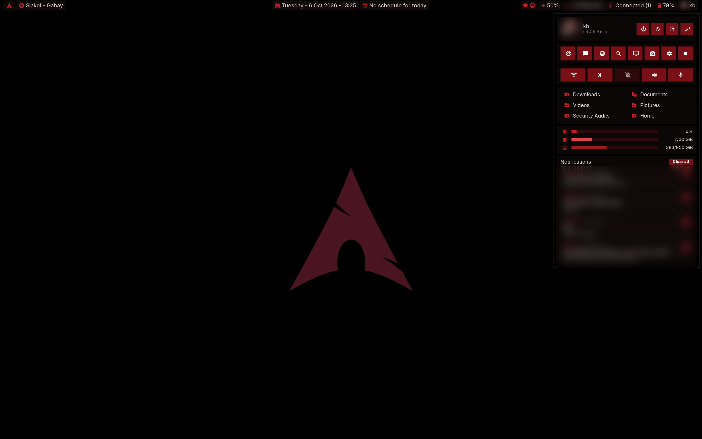

# Oxblood

**A dark-red Hyprland + HyprPanel setup that feels like GNOME but runs like Hyprland.**
Pure OLED black, oxblood and crimson accents, square corners, no animations, no blur. Just a quiet desktop that stays out of your way.


| Media menu with time left | Dashboard | App grid |
|---|---|---|
|  |  |  |

> Private bits (Wi-Fi name, avatar, notifications) are blurred in the screenshots, not in the theme.

---

## The story

*(Partly true, partly embroidered. That's how good rice stories go.)*

It started on a rainy Tuesday in Pasay. A typhoon signal was up, the office had sent everyone home, and I was stuck on a laptop with a GNOME desktop I liked but no longer loved. It was polished and sensible, and it looked like everyone else's.

I had Siakol's *Bakit Ba?* on repeat. Somewhere in the second chorus I looked at the ROG keyboard glowing a deep red in the dark room, then at the cold grey desktop on the screen, and thought: *why don't these match?*

The keyboard was the color of old wine, of a jeepney's faded paint, of the red in a barong's embroidery under lamplight. Designers call it **oxblood**. That became the brief:

1. **Black like the screen is off.** On an OLED panel, true `#000000` pixels cost nothing, so the battery lasts longer and the red really glows.
2. **One color family, used with restraint.** `#4a1521` for surfaces, `#c41e2a` for anything you can press, a pale `#e8dede` for text. No rainbows.
3. **Keep what GNOME got right.** Drag a maximized window and it un-maximizes. Drag a window to an edge and it snaps. Click to focus. One set of window buttons, never two.
4. **Nothing moves unless you move it.** Animations off. The lock screen appears instantly, no fade.

Hyprland gave me the control and HyprPanel gave me the bar. The rest took many late nights: a small C++ plugin to make maximize and snapping behave like GNOME, a few Python/GTK4 popups for the dashboard, app grid and calendar, and patches to HyprPanel so the tray opens on left-click, long song titles scroll instead of being cut off, and the media menu tells you how much of the song is **left**:

```
01:51 / 05:08 (-03:17)
```

That last one came from wanting to know whether I had time for the whole guitar solo before a meeting. (I usually didn't.)

The typhoon passed and I kept the desktop. I hope it works for you too.

---

## What's inside

| Path | What it does |
|---|---|
| `config/hypr/hyprland.lua` | Hyprland config (Lua). GNOME-style focus, gestures, keybinds, no animations |
| `config/hypr/titlebars.lua` | Title bars (hyprbars) with one button set per window; apps that draw their own buttons get no bar |
| `config/hypr/hyprlock.conf`, `hypridle.conf` | Black lock screen with clock and password box; idle → lock → screen off |
| `config/hypr/scripts/` | Edge snapping with preview, snap/maximize helpers, power menu, screenshots |
| `config/hyprpanel/` | HyprPanel theme (oxblood palette), custom modules (calendar, Join-meeting button, status) |
| `config/gtk-3.0`, `gtk-4.0` | GTK accent color so apps match |
| `local/bin/hyprpanel` | Wrapper that patches HyprPanel at launch: left-click tray menus, scrolling song title, **time-left display** |
| `local/bin/kb-*` | Maximize/restore, close, lock (no fade), popups, avatar, next-meeting helpers |
| `local/lib/kbshell/` | GTK4 layer-shell popups: dock, app grid, dashboard, quick settings, agenda, snap preview |
| `plugins/kb-minimize/` | Hyprland plugin: GNOME-like maximize, drag-to-restore, snap, damage fix for flicker |
| `wallpapers/kb-oled-arch.png` | The wallpaper: an oxblood Arch logo on pure black |

## Requirements

- **Hyprland 0.56+** with the **Lua config** (`hyprland.lua`)
- **HyprPanel** (`ags-hyprpanel-git` on the AUR)
- Arch Linux or an Arch-based distro (built on CachyOS). Other distros work if you translate the package names.

### Dependencies (Arch)

```bash
sudo pacman -S --needed hyprland hyprpaper hypridle hyprlock hyprpolkitagent \
  python-gobject gtk4 gtk4-layer-shell gjs jq imagemagick grim slurp \
  brightnessctl networkmanager libnotify playerctl wireplumber \
  cmake gcc git pkgconf ttf-jetbrains-mono-nerd adwaita-fonts
yay -S ags-hyprpanel-git
```

Optional apps used by the default keybinds: `ptyxis` (terminal), `nautilus` (files), `thorium-browser` (browser). Swap them at the top of `hyprland.lua`.

## Install

```bash
git clone https://github.com/kestradacitem/oxblood-hyprland.git
cd oxblood-hyprland
./install.sh
```

The installer:

1. warns about anything missing,
2. **backs up** your current `~/.config/hypr`, `~/.config/hyprpanel`, GTK css and any clashing scripts to `~/.oxblood-backup-<date>/`,
3. copies everything in and fills in your home path,
4. builds the two plugins (`kb-minimize` and `hyprbars`) for **your** Hyprland version into `~/.local/lib/hyprland/`.

Then log out and choose the **Hyprland** session.

Make sure `~/.local/bin` is in your `PATH` **before** `/usr/bin`, so the patched `hyprpanel` wrapper runs instead of the stock one.

Configs only, no compiling: `./install.sh --no-build`

### After a Hyprland update

Plugins are tied to the Hyprland version. If title bars disappear, you'll get a notification at login; rerun `./install.sh` to rebuild.

### Uninstall

Copy your files back from `~/.oxblood-backup-<date>/`.

## Make it yours

- **Monitor scale**: `hl.monitor(... scale = 1.5 ...)` near the top of `hyprland.lua` (set for a 2880×1800 laptop panel).
- **Keyboard layout**: `kb_layout = "us"` in `hyprland.lua`.
- **Colors**: HyprPanel colors are in `config/hyprpanel/config.json` (`theme.*`). Window borders are in `hyprland.lua`, popups in `local/lib/kbshell/base.py`.
- **Dashboard shortcuts**: `menus.dashboard.shortcuts.*` in `config/hyprpanel/config.json`.
- **Calendar / Join button**: optional. Put a published Outlook/Google **ICS link** in `~/.config/kb-calendar/outlook.ics.url` (`chmod 600` it). Without it the bar just says "No schedule for today".

## Keybinds

| Keys | Action |
|---|---|
| `Super` (tap) / `Super + A` | App grid & window overview |
| `Super + Return` | Terminal |
| `Ctrl + Alt + T` | Terminal (fish) |
| `Super + B` / `Super + E` | Browser / Files |
| `Super + Q` / `Alt + F4` | Close window |
| `Super + F` | Maximize / restore |
| `Super + Shift + F` | Real fullscreen |
| `Super + ←` / `→` / `↑` / `↓` | Snap left / right / maximize / restore |
| `Super + T` | Toggle floating |
| `Super + H` / `Super + Shift + H` | Minimize / show minimized |
| `Super + V` | Notifications |
| `Super + L` | Lock |
| `Super + PgUp` / `PgDn` | Previous / next workspace |
| `Print` / `Shift + Print` / `Super + Shift + S` | Screenshot area / full / area |
| `Ctrl + Alt + Del` / Power key | Power menu |
| `Super + Shift + M` | Exit Hyprland |
| 3-finger swipe ← → | Switch workspace |
| 3-finger swipe ↑ / ↓ | Open / close overview |

## Credits

- [Hyprland](https://hyprland.org) and [hyprland-plugins](https://github.com/hyprwm/hyprland-plugins) (hyprbars) by vaxry and contributors
- [HyprPanel](https://github.com/Jas-SinghFSU/HyprPanel) by Jas Singh and contributors
- Arch Linux logo is a trademark of the Arch Linux project; used here in a fan wallpaper
- Siakol, for the soundtrack

## License

[MIT](LICENSE). Take it, change it, make it yours. A star or a screenshot of your version is always welcome.
